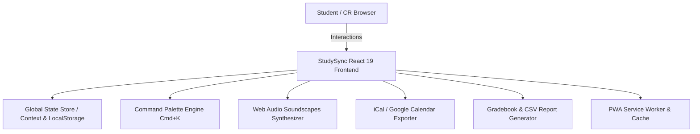

<div align="center">

# 🎓 StudySync
### Modern Academic Class Coordination & Productivity Command Center

[](https://github.com/bash30ribs/studysync/actions)
[](https://react.dev/)
[](https://www.typescriptlang.org/)
[](https://vitejs.dev/)
[](https://tailwindcss.com/)
[](https://vitest.dev/)
[](https://opensource.org/licenses/MIT)

<p align="center">
  <b>StudySync</b> is a lightweight, high-velocity class coordination platform bridging the gap between Class Representatives (CRs) and students. Eliminate missed deadlines, fragmented WhatsApp chaos, and coordination friction with real-time consensus, automated reminders, and calendar synchronization.
</p>

</div>

---

## ⚡ Key Highlights & Features

### 📅 Smart Assignment & Schedule Engine
- **Deadline Cadence & Smart Suggester**: AI-assisted assignment scheduling that avoids exam and lab clashes.
- **RFC 5545 iCal & Google Calendar Sync**: 1-click export to Google Calendar, Apple Calendar, and Outlook with automated 24h reminders.
- **Submission Pace Predictor**: Visual progress analytics comparing current cohort turn-in rate against historical averages.

### 📢 High-Trust CR Operations
- **Streamlined Command Hub**: Decluttered, distraction-free CR overview focusing on actionable deadlines, 1-tap broadcasts, and real-time turn-in ratios.
- **Urgent Broadcasts**: Instantly dispatch pinned announcements with character countdown and real-time delivery.
- **Consensus Polls**: Rapid single & multi-choice polls for exam prep reschedule requests and class feedback.
- **Verified Digital Submissions**: Cryptographic submission hashes, device proofs, and timestamps for dispute-free grading.
- **Attendance Session Tracker**: Fast roster roll-calls with exportable attendance CSV reports.
- **Personal Student Analytics**: Detailed attendance audit, defaulter threshold tracking, and per-subject breakdown.
- **Flutter Mobile Companion**: Cross-platform mobile app in `mobile/` with offline cache awareness.

### 🎧 Deep Focus & Gamification Layer
- **Procedural Soundscapes**: Web Audio synthesizer with Brown Noise, Rain, Pink Noise, and 10Hz Alpha Binaural beats without heavy audio assets.
- **Academic Streaks & Badges**: Gamified study habits with streak multipliers, XP progression, and daily study quests.
- **Global Command Palette (`⌘ + K`)**: Lightning-fast universal navigation across all class resources and views.
- **Offline PWA Support**: Progressive Web App with caching and instant mobile install capability.

---

## 🏗️ Architecture Overview



---

## ⌨️ Power User Keyboard Shortcuts

| Shortcut | Action |
| :--- | :--- |
| <kbd>⌘</kbd> + <kbd>K</kbd> / <kbd>Ctrl</kbd> + <kbd>K</kbd> | Open Global Command Palette |
| <kbd>G</kbd> then <kbd>D</kbd> | Navigate to Main Dashboard |
| <kbd>G</kbd> then <kbd>A</kbd> | Navigate to Assignments Hub |
| <kbd>G</kbd> then <kbd>C</kbd> | Navigate to Class Schedule & Calendar |
| <kbd>G</kbd> then <kbd>R</kbd> | Navigate to Resource Library |
| <kbd>N</kbd> then <kbd>A</kbd> | Quick Modal to Create New Assignment |
| <kbd>N</kbd> then <kbd>B</kbd> | Quick Modal to Create Emergency Broadcast |
| <kbd>Alt</kbd> + <kbd>S</kbd> | Open Focus Soundscapes Ambient Player |
| <kbd>?</kbd> | Open Keyboard Shortcuts Cheat Sheet |

---

## 🚀 Quick Start & Local Setup

### Prerequisites
- **Node.js**: `v20.x` or higher
- **npm**: `v10.x` or higher

### Installation

```bash
# Clone the repository
git clone https://github.com/bash30ribs/studysync.git
cd studysync

# Install dependencies
npm install

# Start local development server
npm run dev
```

Visit `http://localhost:5173` to explore StudySync locally.

---

## 🧪 Testing & Verification

```bash
# Run unit test suite
npm run test

# Run fast linter
npm run lint

# Build production bundle with optimized chunking
npm run build
```

---

## 🛠️ Tech Stack & Tooling

- **Core**: React 19, TypeScript 6.0, Vite 6
- **Styling**: Tailwind CSS v4, Lucide Icons, Canvas Confetti
- **Audio Synthesis**: Web Audio API (Brownian & Pink noise oscillators, stereo panning)
- **Quality**: Vitest, Oxlint, GitHub Actions CI Pipeline

---

## 📄 License

Distributed under the **MIT License**. See `LICENSE` for more information.
